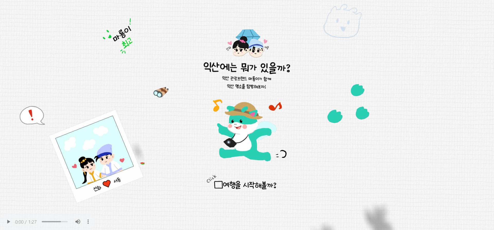
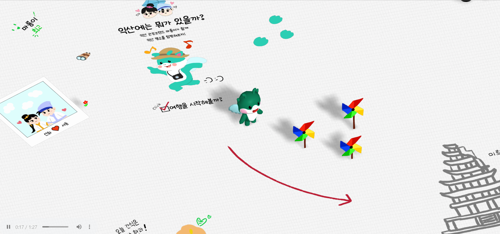
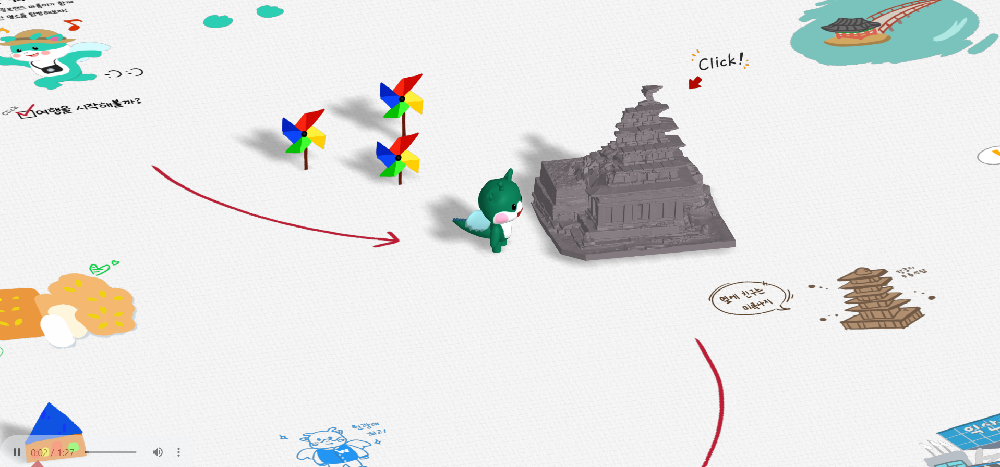
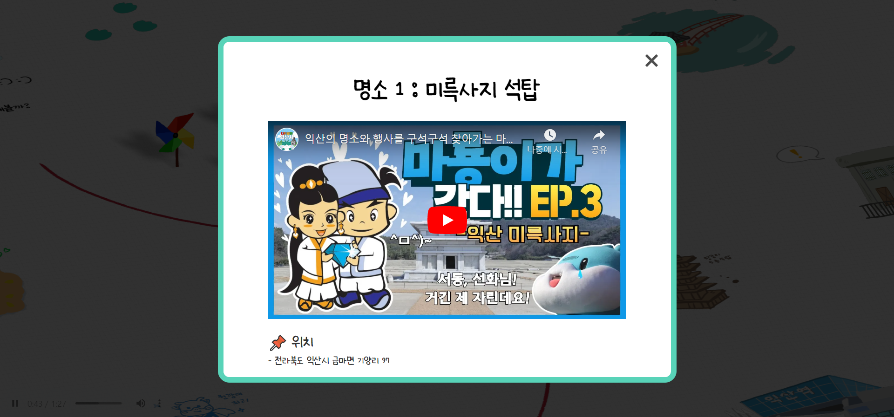
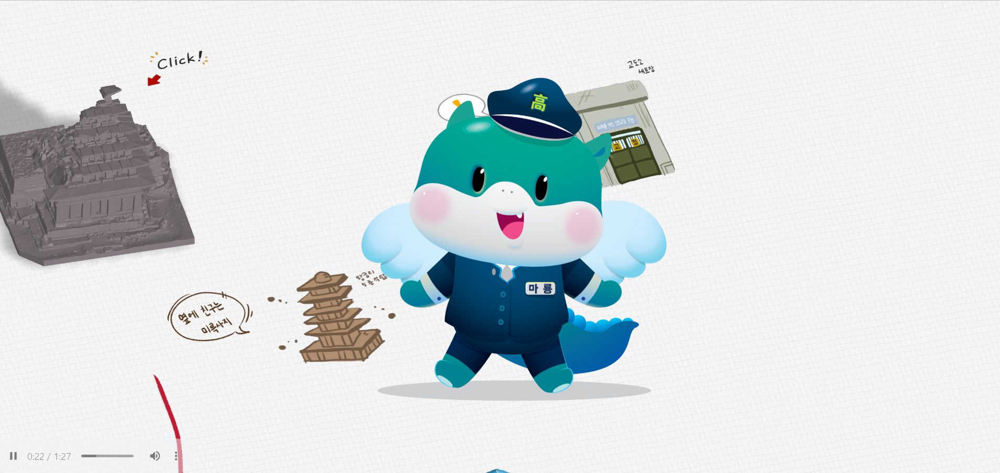

# 3D 웹으로 익산을 탐방하는 서비스

대부분의 소개 페이지는 많은 단락이 글로만 이루여져 있고 눈길을 끌어오는 아이템이 없어 오래 머무르기 힘들었다.  
이런 점을 보완하고자 사람들의 호기심과 흥미를 유발하고 보고 싶도록 만드는 익산 소개 서비스를 만들게 되었다.
 
 

## 서비스 화면

### 배속 영상

 
 

### 사진

 
 

## 우리의 웹 서비스는?

1. **형식의 제약이 없다.**  
   사용자를 제약하지 않고 서비스와 자유롭게 상호작용하게하여 오래 머무르게 하는 효과를 얻을 수 있다.

2. **홍보 효과**
   대부분의 소개 페이지나 블로그는 본인이 원하는 정보를 얻기 위한 사람들이 많이 찾는다.  
   그러나 이 서비스는 3D 게임같은 환경, 아기자기한 그림 등을 통해 익산을 몰랐던 사람들이라도 쉽게 관심을 가질 수 있다.

3. **사용자 확보 및 지역 발전에 이바지**  
   익산의 다양한 관광지에 대한 정보를 쉽고 재미있게 얻을 수 있으며,  
   지자체는 익산의 관광지를 널리 알리고 많은 관광객을 유치함으로서 지역 발전에 이바지 할 수 있다.  
   재미 요소가 있는 서비스는 빠르게 많은 사용자를 확보해왔다.

 
 

## 팀 역할

- 안정현 - FrontEnd, 그림
- 이상희 - FrontEnd, 그림
   
   

## 도움을 주신 분 및 출처

- 심하연 - 마룡이 3D 모델
- 국가문화유산포털 - 관광 3D 모델

   
   
